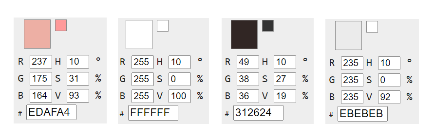

## **SUNFLOWER**

### **Acerca del proyecto:** 
Es un sitio dedicado a la comercialización de productos de vivero. 

### **Público objetivo:** El sitio apunta a hombres y mujeres de más de 20 años.

### **Integrantes del equipo:**
1. Julia Burundarena: Docente
2. Johanna Niño: Experiencia en docencia y coordinadora de proyectos tecnológicos.
3. Ariel Cruz: Administrador de una empresa de seguridad 

### **Wireframes:**
https://www.figma.com/file/sBjmJkEsVOPOP7fw0O2rJm/SUNFLOWER?node-id=0%3A1

### **Sitios de referencia:**

* https://tienda.viveromario.com.ar/ --> referente de mismo nicho productivo
* https://www.viverotierranegra.com/ --> referente de mismo nicho y diseño agradable
* https://domicilios.hornitos.co/?step=2&stepName=selector_de_tipo_de_servico --> referente de diseño
* http://www.buenosairesbakery.com.ar/ --> referente de diseño
* https://bellroy.com/ --> referente de diseño
* https://growplantshop.com/ --> referente al diseño y funcionalidad

### **Paleta de colores:**

### **Logo:** [_Ver logo_](desing/sunflowerLogo.png)
 

### **Tablero de trabajo:** 
https://trello.com/b/eqHONEIy/digitalhousetareas

### **Modelo relacional-Database:** [_Ver modelo en pdf_](db/DB_Sunflower.com.pdf)

